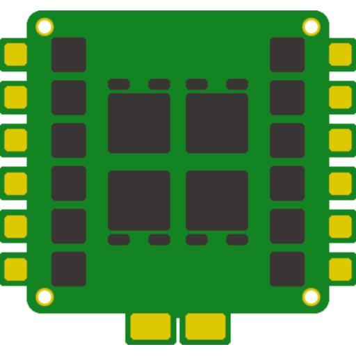

 
   

# ESC Configurator - PWA (Progressive Web App)
A progressive web-app to flash your BLHeli_S capable ESCs directly from the web using the [Web Serial API](https://wicg.github.io/serial/) or the [Web USB API](https://wicg.github.io/webusb/) as a fallback for Chrome on Android. The Web USB solution will work on a majority of android devices, but not all. Unfortunately it is not possible to detect if it will work, you will simply have to try. Also see this [SO thread](https://stackoverflow.com/questions/66771484/webusb-can-not-claim-device-on-some-android-devices) and this [Chromium issue](https://bugs.chromium.org/p/chromium/issues/detail?id=1099521).

> The latest state of the master branch can be [viewed in the browser](https://esc-configurator.com)

This project is basically a re-write and clean up of the original [BLHeli Configurator](https://github.com/blheli-configurator/blheli-configurator). Some bits and pieces have been re-used - mainly the ones concerning the actual flashing part.

I did this since I was interested in having this as an web app, but also because the original BLHeli configurator code was too much for me to re-factor and I thought I might be able to re-write it in the same amount of time.

I also tried to go with one front-end framework - **React**. Instead of having a mixture of lots of different stuff.

I re-used most of the look and feel of the original configurator, but since this is used on the web, adaptations to style are very much welcome. In the long run I can see this also be used on mobile phones via OTG port - once the [Web Serial API](https://wicg.github.io/serial/) makes it to there.

## Supported Platforms & Firmware
Currently the SiLab EMF8 MCU's are supported with the following firmware:

### SiLab EFM8:

* [BLHeli_S](https://github.com/bitdump/BLHeli)
* [Bluejay](https://github.com/mathiasvr/bluejay)

### ARM:

* [AM32](https://github.com/AlkaMotors/AM32-MultiRotor-ESC-firmware)

### Adding new firmware
If you are a firmware developer please feel free to drop an issue so I can add your firmware. Look at how BLHeli and Bluejay are implemented.

If your firmware is based on BLHeli, make sure that you set a NAME in your layout - this allows me to easily identify which firmware is flashed and act accordingly.

### Adding new platforms
Right now only SiLabs EFM8 MCU's are supported. But a lot of ARM and Atmel related code is ported, just the flashing is not implemented. If you want to see those features added and are willing to help, please tell me so in the issue section.

## Translations
Translations are managed via [crowdin](https://crowdin.com/project/esc-configuratorcom) so head on over there and contribute to the translations. Should your language not be enabled yet, let me know in the issues and I will add it.

## Contributing
Contributions are very welcome. Feel free to submit PR's and discuss feature requests - I am open for all suggestions. If you submit a PR please also **provide tests** where it makes sense. Some tests can not (yet) be easily automated, like playing music or the actual flashing process without having to heavily mock those components.

If you do submit a PR, please do so against the **develop** branch. Also make sure that your code matches the linting rules. If you get warnings, try to adapt your code accordingly. If the rule makes no sense or can't really be satisfied it's OK to submit your PR anyway.

### Dev Setup
Simply clone the repository, install dependencies and run the dev server. Pull requests are more than welcome.

Search the codes for TODO or IMPROVEMENTS, there is a lot that still can be done.

#### Install dependencies

    yarn

#### Start dev server

    yarn start

#### Build

    yarn build

The build is then available from the build directory and can be served by simply hosting the content of the directory or via serve:

    serve -s build -l 1234

#### Linting and testing

    yarn lint
    yarn test
    yarn test:watch
    yarn test:coverage

## History & Credits
This configurator is based on [BLHeli Configurator](https://github.com/blheli-configurator/blheli-configurator) which was based on [Cleanflight Configurator](https://github.com/cleanflight/cleanflight-configurator) which itself was based on [Baseflight Configurator](https://github.com/multiwii/baseflight-configurator). I would like to thank everyone who contributed to one of those projects, without you this project would not be possible.

### Authors & Contributors
To continue the legacy of everyone who was mentioned as author or contributor in one of the previously mentioned projects:

* Dominic Clifton aka. hydra - maintainer of the [Cleanflight firmware](https://github.com/cleanflight/cleanflight) and [configurator](https://github.com/cleanflight/cleanflight-configurator).
* ctn - primary author and maintainer of [Baseflight Configurator](https://github.com/multiwii/baseflight-configurator) from which [Cleanflight Configurator](https://github.com/cleanflight/cleanflight-configurator) project was forked.
* Andrey Mironov aka. DieHertz - primary author of [BLHeli Configurator](https://github.com/blheli-configurator/blheli-configurator)
* Michael Keller aka. mikeller - maintainer of [BLHeli Configurator](https://github.com/blheli-configurator/blheli-configurator)
* Stefan van der Ende
* Nathan
* Steffen Windoffer
* Steven R. Lilly
* Tuomas Kuosmanen
* Robyn Bachofer
* ByeJon

#### Authors & Contributors for esc-configurator
* Mathias Rasmussen aka. mathiasvr - primary motivator and contributor for [esc-configurator](https://github.com/stylesuxx/esc-configurator)
* Chris Landa aka. stylesuxx - primary author and maintainer of [esc-configurator](https://github.com/stylesuxx/esc-configurator)
* Georg Oberleitner aka. Noctaro - German translation & Logo
* Hugo Chiang aka. DusKing1 - Chinese translation
* Asier Ruiz aka. Asizon - Spanish translation
* djtms - Polish translation

If you feel that your name should be mentioned in the authors section, please do not hesitate to submit a pull request.
